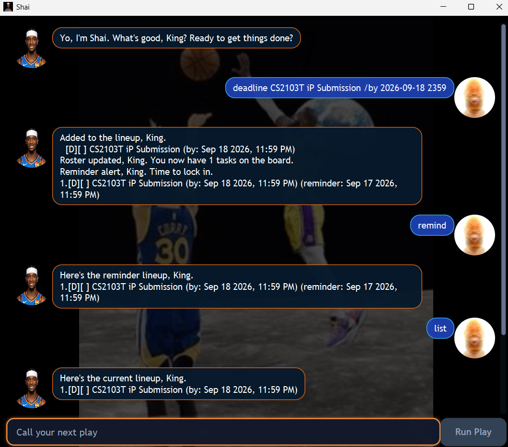

# Shai User Guide

Shai is your basketball-themed task manager. Use quick commands to keep your
ToDos, deadlines, and events on the board, then focus on making your next play.



## Quick start

1. Make sure JDK 25 is installed.
2. From the project folder, run `.\gradlew.bat run` on Windows or `./gradlew run`
   on macOS/Linux. You can also run `shai.gui.Launcher` from IntelliJ. These
   options open Shai's graphical interface.
3. To use the command-line interface from IntelliJ, run `shai.Shai` instead.
4. Type a command into the input box and click **Run Play**. In the command-line
   interface, type a command and press Enter instead.
5. Use `list` to see your tasks and their task numbers.

Shai saves your tasks automatically in `data/shai.txt` after every successful
change and loads them again the next time you start the application.

## Command format

Words in angle brackets are values that you provide. For example,
`todo <description>` becomes `todo buy milk`.

Dates can be written as `yyyy-MM-dd` or `d/M/yyyy`. Add a time using either
`HHmm` or `HH:mm`, such as `2026-09-18 1700` or `18/9/2026 17:00`. A date without
a time is treated as midnight. Use one space between command parameters.

## Features

### Add a ToDo: `todo`

Adds a task without a date or time.

```text
todo buy milk
```

### Add a deadline: `deadline`

Adds a task that must be completed by a specified date or time.

```text
deadline submit report /by 2026-09-18 1700
```

### Add an event: `event`

Adds an event with a starting and ending time. The ending time must be after
the starting time.

```text
event team meeting /from 2026-09-18 1400 /to 2026-09-18 1600
```

Deadlines and events receive a reminder one day before the deadline or event
start by default.

### List all tasks: `list`

Shows every task and its task number.

```text
list
```

An incomplete task is shown as `[ ]`; a completed task is shown as `[X]`.
Deadlines are labelled `[D]` and events are labelled `[E]`.

### Find tasks: `find`

Finds tasks whose descriptions contain the keyword. The search is
case-insensitive.

```text
find report
```

### Mark a task as complete: `mark`

Marks the task with the specified number as complete.

```text
mark 1
```

### Mark a task as incomplete: `unmark`

Marks the task with the specified number as incomplete again.

```text
unmark 1
```

### Delete a task: `delete`

Deletes the task with the specified number. Check `list` first if you are not
sure which number to use.

```text
delete 2
```

### Manage reminders: `remind`

List reminders scheduled within the next seven days:

```text
remind
```

Reminders are listed chronologically. If a reminder has been missed but its
deadline or event is still upcoming, it appears in a separate missed-reminders
section. Completed, disabled, overdue, and more distant tasks are not shown.

Set a reminder for a deadline or event using minutes (`m`), hours (`h`), or
days (`d`) before its deadline or start time:

```text
remind 1 /before 30m
remind 2 /before 2h
remind 3 /before 1d
```

Use `0m` to remind yourself exactly at the deadline or event start:

```text
remind 1 /before 0m
```

Disable a reminder with:

```text
remind 1 /off
```

Only deadlines and events support reminders. Shai also displays an automatic
alert at startup and after successful commands when a reminder is due within
the next 24 hours. Each automatic alert appears only once per session; Shai
does not run a background notification service.

### Exit Shai: `bye`

Ends the current Shai session.

```text
bye
```

## Command summary

| Action | Format |
| --- | --- |
| Add ToDo | `todo <description>` |
| Add deadline | `deadline <description> /by <date/time>` |
| Add event | `event <description> /from <date/time> /to <date/time>` |
| List tasks | `list` |
| Find tasks | `find <keyword>` |
| Mark complete | `mark <task number>` |
| Mark incomplete | `unmark <task number>` |
| Delete task | `delete <task number>` |
| List reminders | `remind` |
| Set reminder | `remind <task number> /before <duration>` |
| Disable reminder | `remind <task number> /off` |
| Exit | `bye` |

Task numbers are positive numbers shown by `list`. If a command is invalid,
Shai explains the problem and stays ready for your next play.
